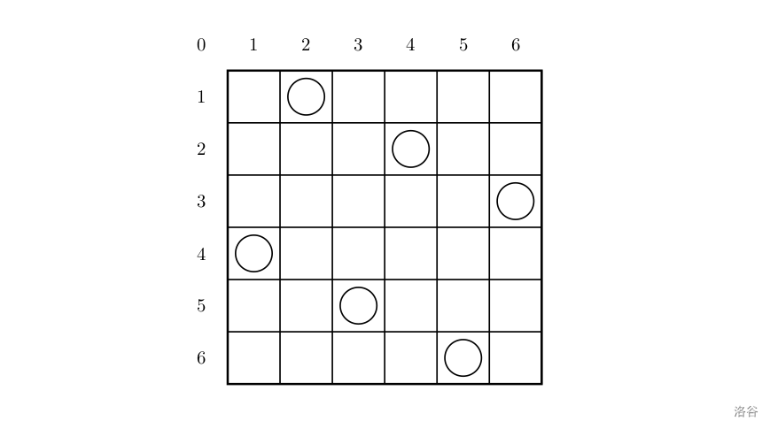

### 2024年1月18日

今天先把昨天没有修好的八皇后问题代码修好（并没有完全修好，仍然存在TLE的问题，应该可以打表解决，先不动了）

1. **题目练习**

   1. **题目：**<u>（八皇后问题）</u>一个如下的 6×6 的跳棋棋盘，有六个棋子被放置在棋盘上，使得每行、每列有且只有一个，每条对角线（包括两条主对角线的所有平行线）上至多有一个棋子。

      

      上面的布局可以用序列 2 4 6 1 3 52 4 6 1 3 5 来描述，第 *i* 个数字表示在第 *i* 行的相应位置有一个棋子，如下：

      行号 1 2 3 4 5 61 2 3 4 5 6

      列号 2 4 6 1 3 52 4 6 1 3 5

      这只是棋子放置的一个解。请编一个程序找出所有棋子放置的解。
      并把它们以上面的序列方法输出，解按字典顺序排列。
      请输出前 3 个解。最后一行是解的总个数。

      **本人解答**（74分，仍留下两个检查点由于超时没过，暂时不动了）

      ```c++
      #include <bits/stdc++.h>
      using namespace std;
      int n;
      int counts = 0;
      const int N = 15;
      int vis[N][N] = {0};
      bool check(int x, int y) {
          if (x < 1 || x > n || y < 1 || y > n) {
              return false;
          }else {
              return true;
          }
      }
      void mark(int x, int y) {
          // 标记平行线以及对角线所有的点
          for (int i = 1; i <= n; ++i) {
              if (check(x, i)) vis[x][i] = 1;
              if (check(i, y)) vis[i][y] = 1;
              if (check(i, x + y - i)) vis[i][x + y - i] = 1;
              if (check(x - y + i, i)) vis[x - y + i][i] = 1;
          }
      }
      void dfs(int num, int x, int y, string s) {
          if (num >= n) {
              counts++;
              if (counts <= 3) {
                  cout << s << endl;
              }
              return;
          }
          // 标记
          for (int i = 1; i <= num; ++i) {
              int tmps = -1;
              int tmpe = -1;
              int tmpcount = 0;
              for (int j = 0; j < s.length(); ++j) {
                  tmps = tmpe + 1;
                  if (s[j] == ' ') {
                      tmpe = j;
                      tmpcount++;
                  }
                  if (tmpcount == i) break;
              }
              mark(i, stoi(s.substr(tmps, tmpe - tmps)));
          }
          for (int i = 1; i <= n; ++i) {
              if (vis[num + 1][i] == 0 && check(num + 1, i)) {
                  dfs(num + 1, num + 1, i, s + to_string(i) + " ");
              }
          }
          // 取消上一层标记
          for (int i = 1; i <= n; ++i) {
              for (int j = 1; j <= n; ++j) {
                  vis[i][j] = 0;
              }
          }
          for (int i = 1; i <= num - 1; ++i) {
              int tmps = -1;
              int tmpe = -1;
              int tmpcount = 0;
              for (int j = 0; j < s.length(); ++j) {
                  tmps = tmpe + 1;
                  if (s[j] == ' ') {
                      tmpe = j;
                      tmpcount++;
                  }
                  if (tmpcount == i) break;
              }
              mark(i, stoi(s.substr(tmps, tmpe - tmps)));
          }
          return;
      }
      int main()
      {
          cin >> n;
          string s = "";
          dfs(0, 0, 0, s);
          cout << counts;
          return 0;
      }
      ```

      **可优化**

      - 可以采用打表的方式优化速度

   2. **题目：**<u>（迷宫问题）</u>*给定一个N*×*M* 方格的迷宫，迷宫里有 *T* 处障碍，障碍处不可通过。

      在迷宫中移动有上下左右四种方式，每次只能移动一个方格。数据保证起点上没有障碍。

      给定起点坐标和终点坐标，每个方格最多经过一次，问有多少种从起点坐标到终点坐标的方案。

      **本人解答：**

      ```c++
      #include <bits/stdc++.h>
      using namespace std;
      const int maxN = 10005, maxM = 10;
      char mp[maxN][maxM];
      int dir[4][2] = {{1, 0}, {-1, 0}, {0, 1}, {0, -1}};
      int N, M, T;
      int sx, sy, fx, fy;
      int ans = 0;
      bool check(int x ,int y) {
          if (x < 1 || x > N || y < 1 || y > M)
              return false;
          else
              return true;
      }
      void dfs(int level, int x, int y) {
          if (x == fx && y == fy) {
              ans++;
              return;
          }
          mp[x][y] = '#';
          // 遍历四个方向
          for (int i = 0; i < 4; ++i) {
              int newx = x + dir[i][0], newy = y + dir[i][1];
              if (mp[newx][newy] != '#' && check(newx, newy))
                  dfs(level + 1, newx, newy);
          }
          mp[x][y] = 0;
      }
      int main()
      {
          memset(mp, 0, sizeof(mp));
          cin >> N >> M >> T;
          cin >> sx >> sy >> fx >> fy;
          for (int i = 0; i < T; ++i) {
              int tmpx, tmpy;
              scanf("%d %d", &tmpx, &tmpy);
              mp[tmpx][tmpy] = '#';
          }
          dfs(0, sx, sy);
          cout << ans;
          return 0;
      }
      ```

      **记录一下途中遇到的问题，谨记**

      1. 方向（direction）数组的值问题，如果是上下左右，那么可以认为是：

         ```c++
         dir[4][2] = {{1, 0}, {-1, 0}, {0, 1}, {0, -1}};
         ```

         一开始设置的数值为斜角方向的，会导致问题

      2. 打标记的位置，一开始打标记的位置放在了DFS函数入口，在遇到最后一个***出局判断***的时候，会导致终点的标记无法撤销，导致后续的搜索再也没有办法延伸到终点，原来代码为：

         ```c++
         void dfs(int level, int x, int y) {
             mp[x][y] = '#';
             if (x == fx && y == fy) {
                 ans++;
                 return;
             }
             // 遍历四个方向
             for (int i = 0; i < 4; ++i) {
                 int newx = x + dir[i][0], newy = y + dir[i][1];
                 if (mp[newx][newy] != '#' && check(newx, newy))
                     dfs(level + 1, newx, newy);
             }
             mp[x][y] = 0;
         }
         ```

         后改为：

         ```c++
         void dfs(int level, int x, int y) {
             if (x == fx && y == fy) {
                 ans++;
                 return;
             }
             mp[x][y] = '#';
             // 遍历四个方向
             for (int i = 0; i < 4; ++i) {
                 int newx = x + dir[i][0], newy = y + dir[i][1];
                 if (mp[newx][newy] != '#' && check(newx, newy))
                     dfs(level + 1, newx, newy);
             }
             mp[x][y] = 0;
         }
         ```

         

      **再次记录一下模板**

      ```c++
      ans;
      void dfs(层数, 其他参数) {
          if (出局判断) {
              更新答案;
              return;
          }
          (剪枝)
          for (枚举下一层可能的情况)
              if (used[i] == 0) {
                  used[i] = 1;
                  dfs(层数 + 1, 其他参数);
                  used[i] = 0;
              }
          return;
      }
      ```

      **可优化处**

      - 看到一个比较好的思路，可以**不考虑边界，直接初始化，将边界当作障碍。**[题解](https://www.luogu.com.cn/problem/solution/P1605)

   3. **题目：**单词接龙是一个与我们经常玩的成语接龙相类似的游戏，现在我们已知一组单词，且给定一个开头的字母，要求出以这个字母开头的最长的“龙”（每个单词都最多在“龙”中出现两次），在两个单词相连时，其重合部分合为一部分，例如 `beast` 和 `astonish`，如果接成一条龙则变为 `beastonish`，另外相邻的两部分不能存在包含关系，例如 `at` 和 `atide` 间不能相连。

      **本人解答：**（83，有一个检查点TLE）

      ```c++
      #include <bits/stdc++.h>
      using namespace std;
      const int MAXN = 25;
      int vis[MAXN] = {0};
      string strs[MAXN];
      int n;
      int ans = 0;
      char start_char;
      void dfs(int level, int index, string current_str) {
          if (current_str.length() > ans) {
              ans = current_str.length();
          }
          vis[index]++;
          for (int i = 1; i <= n; ++i) {
              if (vis[i] < 2) {
                  int j, k;
                  string new_str;
                  // 需要一个匹配算法
                  for (j = 0; j < current_str.length(); ++j) {
                      for (k = 0; k < strs[i].length(); ++k) {
                          // 第一次匹配上应该是最长的
                          if (current_str.substr(j, current_str.length() - j) == strs[i].substr(0, strs[i].length() - k)) {
                              new_str = current_str.substr(0, j) + strs[i];
                              break;
                          }
                      }
                  }
                  if (j >= current_str.length() && k < 0) {
                      continue;
                  }
                  dfs(level + 1, i, new_str);
              }
          }
          vis[index]--;
      }
      int main()
      {
          cin >> n;
          for (int i = 1; i <= n; ++i) {
              cin >> strs[i];
          }
          cin >> start_char;
      
          string ans_str = "";
          ans_str += start_char;
          dfs(0, 0, ans_str);
          cout << ans;
          return 0;
      }
      ```

      **可优化处：**

      - 可以额外采用一个函数来判断是否可以接上去，比如[题解](https://www.luogu.com.cn/problem/solution/P1019)中的，思路可以采取先在前段文字末尾开始向前搜索看能否找到与后段字符串开头相同的字符，找到了就开始向后搜索，若存在一个不一样的就不行。

        ```c++
        int find(int last,int next)
        //last表示上一个单词序号，next表示要连接的单词序号
        //inline 用于加速，写不写无所谓
        {
            int lenl=w[last].line.length(),lenn=w[next].line.length();
            //这个长度可以在输入的时候就处理好，这么写麻烦了，大家自行优化；
            for(int i=lenl-1;i>=1;--i)//倒着搜
            {
                if(w[last].line[i]==w[next].line[0])
                {
                    //搜到了有一位相同，可能可以连接，“正”过来搜
                    int k=i,j=0,cl=0;
                    while(j<lenn && k<lenl)
            		//要保证搜索的长度小于前一个单词和后一个单词的长度的长度，有一个不成立都代表搜索结束了；
                    {
                        if(w[last].line[k]==w[next].line[j])++cl;
                        else return 0;
                        ++k;++j;
                    }
                    if(k==lenl && j<lenn)return cl;
            		//如果前一个单词搜到了最后一个，并且搜到的小于后面那个单词的长度（不然就包含在这个单词里面，不能使龙长度增加，无效，不能连接），就返回重复的值
                    else return 0;
            		//否则搜到一个不一样，返回0，重叠部分为0；
                }
            }
            return 0;
            //把前一个单词搜完了还没找到，也代表不能连接，重叠部分0；
        }
        ```

        

