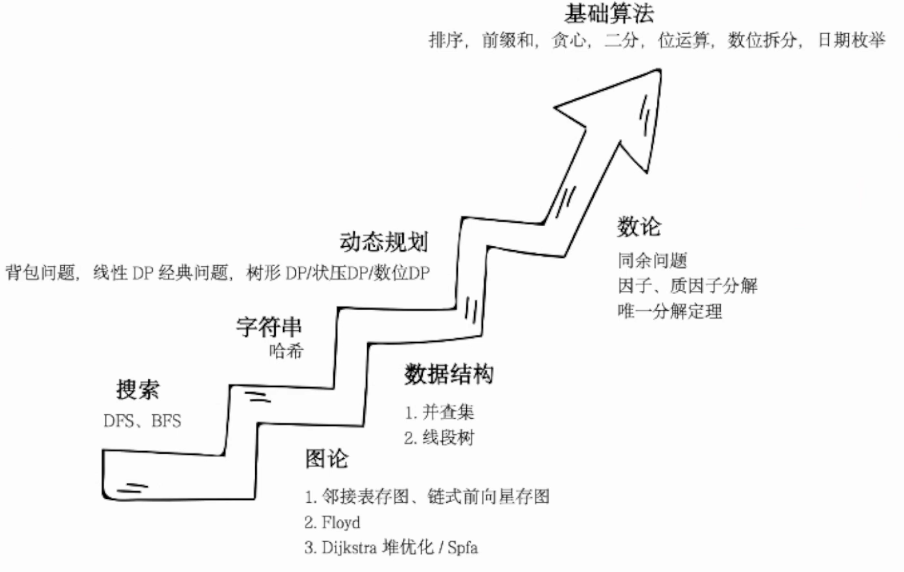

### 2024年1月21日

看一下竞赛基本大纲

1. 组别&赛程&形式

   - 4小时
   - 提交到备赛系统

2. 环境

   - Dev-cpp 5.11
   - 可以翻阅C/C++文档

3. 题型

   - 结果填空（20% 两道题）
     - 具有确定解
     - 只填写结果
     - 可以用各种软件帮助
   - 程序设计（80% 八道题）
     - 描述、输入、输出

4. 考纲

   - 算法

     枚举、排序、搜索、计数、贪心、动态规划、图论、数论、字符串算法

   - 数据结构

     数组、对象/结构、字符串、队列、栈、图、堆、平衡树/线段树

   
   
   **并查集/线段树**、**字符串哈希**
   
   
