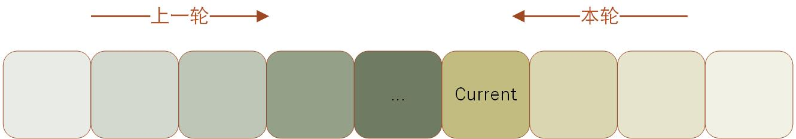

### 2024年2月21日

今天继续学习动态规划

- **练习**

  设有 1g、2g、3g、5g、10g、20g 的砝码各若干枚（其总重≤1000），可以表示成多少种重量？

  **解答：**

  ```c++
  #include <bits/stdc++.h>
  using namespace std;
  int a[10];
  bool mp[1005];
  int weight[6] = {1, 2, 3, 5, 10, 20};
  int counts = 0;
  
  int main()
  {
      // 读入数据，每种砝码有多少
      for (int i = 1; i <= 6; ++i) {
          scanf("%d", &a[i]);
      }
      memset(mp, false, sizeof(mp));
      mp[0] = true;
      for (int i = 1; i <= 6; ++i) {
          for (int j = 1; j <= a[i]; ++j) {
              for (int k = 1000; k >= 0; --k) {
                  if (mp[k]) {
                      mp[k + weight[i - 1]] = true;
                  }
              }
          }
      }
      for (int i = 1; i <= 1000; ++i) {
          if (mp[i]) {
              counts++;
          }
      }
      cout << "Total=" << counts;
      return 0;
  }
  
  ```

  **反思：**

  首先我很好奇，为什么这一类问题用DP解决？

  从DP的概念开始理解，DP是求解多阶段决策问题最优化的一种算法思想

  - 重叠子问题
  - 最优子结构
  - 无后效性

  就拿斐波那契数列来说，为了解决总体问题 `fib(n)` ，将其分解
  $$
  fib(n) = fib(n - 1) + fib(n - 2)
  $$
  在这道题中，我们如果想知道一个状态（首先定义状态，选择前多少组的砝码）有多少种称法，我们可以这样想（ $methods(n)$ 表示选择前 $n$ 组砝码能有的称法数，$nums$ 表示在原有基础上，选择第 $n$ 组能新增的方法数）
  $$
  methods(n) = methods(n - 1) + nums(n)
  $$
  我们能用类似的状态转移，首先定义最外层循环（选择前多少组砝码，从小的开始算）：

  ```c++
  for (int i = 1, i <= 6; i++) {
      // 内容
  }
  ```

  然后定义第二层循环，则选择多少个（ $1 \le j \le a[i]$ ）：

  ```c++
  for (int j = 1; j <= a[i]; j++) {
      // 内容
  }
  ```

  然后定义最内层循环，这里引入存储状态的数组 `mp[i]` ，可以用它来存储哪些重量已经可以称出来：

  ```c++
  for (int k = 1000; k >= 0; k--) {
      // 内容
  }
  ```

  

  至于这个循环为什么从大到小，原理和滚动数组差不多，可以防止数组数据（本轮数据对本轮计算）的影响，拿这张示意图来说，绿色的是上一轮（状态）的数据，黄色的是当前（状态）的数据，我们能够正确地获取上一轮的数据，并且覆盖当前内存单位并不产生影响，滚动数组也是这个道理。

  在此基础上一轮一轮地计算，能够得出所有组的砝码能够称的重量数目（ `for (int i = 1; i <= 1000; i++)` 扫描得到的所有结果为 `true` 的数目）

  **出现的问题：**

  - 因为已经有 `for (int j = 1; j <= a[i]; ++j)` 这一层循环，同一组的砝码数量是逐个递增的，并不需要在后面计算重量时增设 `j * weight[i - 1]` ，这样反而会导致重复计算。只需要 `mp[k + weight[i - 1]] = true;` 。
  - 最后计算总数目时，采用的是扫描整个状态数组，`for (int i = 1; i <= 1000; ++i)` 。

3. **最长公共子序列（Longest Common Subsequence, LCS）**

   一个给定序列的子序列，是在该序列中删去若干元素后得到的序列（和子串不同，子串是连续的）。例如 $X = \{A, B, C, D, A, B\}$ ，它的字串有 $\{A, B, C, B, A\}$ 、$\{A, B, D\}$ 、$\{B, C, D, B\}$​ 等。

   **问题描述：**给定两个序列 $X$ 和 $Y$ ，找出$X$ 和 $Y$ 的一个最长公共子序列。

   **解决方法：**用动态规划求LCS，复杂度为 $O(mn)$。用 `dp[i][j]` 表示序列 $X_i$ （表示 $x_1, x_2, ..., x_i$ 这个序列， 即 $X$ 的前 $i$ 个元素组成的序列；这里用小写的 $x$ 表示元素，用大写的 $X$ 表示序列） 和 $Y_j$ 的最长公共子序列的长度，而对于长度为 $m$ 的序列 $X$ 和 长度为 $n$ 的序列 $Y$ 的公共子序列长度，`dp[m][n]` 就为答案。

   分解为两种情况：

   - 当 $x_i = y_j$ 时，已求得 $X_{i -1}$ 和 $Y_{j - 1}$ 的最长公共子序列，在其尾部加上 $x_i$ 或 $y_j$ ，即可得到$X_{i}$ 和 $Y_{j}$ 的最长公共子序列。状态转移方程为 `dp[i][j] = dp[i - 1][j - 1] + 1` 。
   - 当 $x_i \ne y_j$ 时，求解两个子问题： $X_{i - 1}$ 和 $Y_{j}$ 的最长公共子序列、$X_{i}$ 和 $Y_{j - 1}$​ 的最长公共子序列，取其中的最大值，状态转移方程为 `dp[i][j] = max(dp[i][j - 1], dp[i - 1][j])` 。

   **解题代码（自己编写，没有十足把握正确）：**

   ```c++
   #include <bits/stdc++.h>
   using namespace std;
   string X, Y;
   int dp[10005][10005] = {0};
   
   int main()
   {
       while (cin >> X >> Y) {
           int length;
           for (int i = 1; i <= X.length(); ++i) {
               for (int j = 1; j <= Y.length(); ++j) {
                   if (X[i - 1] == Y[j - 1]) {
                       dp[i][j] = dp[i - 1][j - 1] + 1;
                   }
                   else {
                       dp[i][j] = max(dp[i - 1][j], dp[i][j - 1]);
                   }
               }
           }
           length = dp[X.length()][Y.length()];
           cout << length << endl;
       }
       return 0;
   }
   ```

   反思：

   为什么这种问题用DP解决？

   从DP的概念开始理解，DP是求解多阶段决策问题最优化的一种算法思想

   - 重叠子问题
   - 最优子结构
   - 无后效性

   首先，“最长”，是需要求解最优解，我们能比较清晰的看到**“最优子结构”**的影子，即所谓的**“大问题的最优解包含小问题的最优解”**，为什么呢？可以看到这里的状态转移：
   $$
   dp[i][j] = 
   \begin{cases}
   dp[i - 1][j - 1] + 1 & ,X_i = Y_j\\
   max(dp[i - 1][j], dp[i][j - 1]) & , X_i \ne Y_j
   \end{cases}
   $$
   很清晰的展示了所谓的**“大问题的最优解包含小问题的最优解”**，因此以后再考虑“最优化”相关问题的时候，或许可以考虑，该问题是否跟其子问题有关，然后可以考虑**重叠子问题**，也就是所谓的**子问题是否是原大问题的小版本，计算步骤是否一样**。

   其次，这里的 `dp[i][j]` 在含义上，和前面的有什么相通，又有什么不同？

   - 在这里， `dp[i][j]` 表示序列 $X_i$ 和 $Y_j$ 的最长公共子序列的长度；
   - 在之前的背包问题中，`dp[i][j]` 表示把前 `i` 个物品装入容量为 `j` 的背包中获得的最大价值

   对比发现，`dp[i][j]` 所蕴含的值都是最优化问题（在特定情况下）的解，而此处的两个参数，则为最优化问题（答案会随着该参数变动）的参数，维数则为参数数量（当然，有些问题可以用滚动数组降一个维度，但该问题应该是无法降维的，因为滚动数组要求 `dp[i][]` 只与 `dp[i - 1][]` 相关）。

   某些动态规划问题细究下来也有相通之处。

   