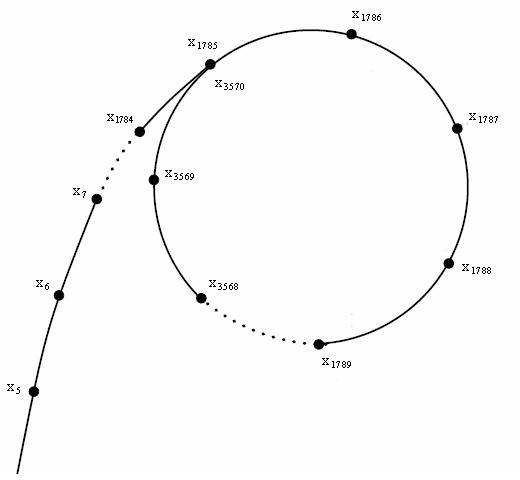

### 2024年3月31日

今天继续学习数论，先从算法课已经学过的素数筛开始，正好回顾一下，然后顺着进度学一下质因数分解问题。

昨天的作业里也有涉及到中国剩余定理的问题，也想来学习一下。

#### 素数筛

逐个判断素数速度慢，可以用素数筛*把非素数筛掉*。常用素数筛有**埃氏筛**和**欧拉筛**，欧拉筛的时间复杂度为 $O(n)$ ，不可能更快了。

1. 埃氏筛（埃拉托斯特尼筛法）

   古老而简单的方法，直接利用了素数的定义。

   - 初始队列 $\{ 2, 3, 4, 5, 6, 7, 8, 9, 10, 11, 12, 13, ..., n\}$
   - 输出最小的素数 $2$ ，然后筛掉 $2$ 的倍数，得 $\{ \underline{2}, 3, \underline{4}, 5, \underline{6}, 7, \underline{8}, 9, \underline{10}, 11, \underline{12}, 13, ..., n\}$​ 
   - 输出最小的素数 $3$ ，然后筛掉 $3$ 的倍数，得 $\{ \underline{2}, \underline{3}, \underline{4}, 5, \underline{6}, 7, \underline{8}, \underline{9}, \underline{10}, 11, \underline{12}, 13, ..., n\}$​ 
   - 输出最小的素数 $5$ ，然后筛掉 $5$ 的倍数，得 $\{ \underline{2}, \underline{3}, \underline{4}, \underline{5}, \underline{6}, 7, \underline{8}, \underline{9}, \underline{10}, 11, \underline{12}, 13, ..., n\}$​ 
   - 继续以上步骤，直到队列为空。

   给出代码

   -  `visit[i]` 记录数 $i$​ 的状态
     - `visit[i] = true` ，被筛掉了，不是素数
   - `prime[]` 存放素数
     - 比如 `prime[0]` 是第 $1$ 个素数 $2$ 

   ```c++
   const int N = 1e7;
   int prime[N + 1];
   int visit[N + 1];
   int E_sieve(int n) {
     int k = 0;
     for (int i = 0; i <= n; i++) visit[i] = false; // 初始化
     for (int i = 2; i <= n; i++) { // 从第一个素数2开始
       if (!visit[i]) {
         prime[k++] = i;
         for (int j = 2 * i; j <= n; j += i) // 倍数
           visit[j] = true;
       }
     }
     return k; // 返回素数个数
   }
   ```

   对于上述代码，有两处可以优化的。

   - 用来做筛选的数 $2, 3, 5, ...$ 最多到 $\sqrt{n}$ 就可以了，其原理和*试除法*一样（非素数 $k$ 一定可以被一个小于等于 $\sqrt{k}$ 的素数整除）
   - `for (int j = 2 * i; j <= n; j += i)` 中的 `j = 2 * i` 可以优化为 `j = i * i`

   ==优化后的代码==：

   ```c++
   int E_sieve(int n) {
     int k = 0;
     for (int i = 0; i <= n; i++) visit[i] = false;
     for (int i = 2; i <= sqrt(n); i++) { // 到sqrt(n)
       if (!visit[i]) {
         prime[k++] = i;
         for (int j = i * i; j <= n; j += i)
           visit[j] = true;
       }
     }
     return k;
   }
   ```

   - 时间复杂度： $O(n \log_{2}{\log_{2}{n}})$ ，接近线性
   - 空间复杂度：当 $N = 10^{7}$ 时，约 10MB

   看着还不错，但还有提升空间，埃氏筛做了一些无用功，某个数可能会被筛到好几次。

2. 欧拉筛

   欧拉筛（Sieve of Euler），一种线性筛，是对埃氏筛的改进，能在 $O(n)$ 线性时间内求得 $1 \sim n$ 的所有素数。

   **原理**：一个合数肯定有一个最小质因数，让每个合数只被他的最小质因数筛选一次，以达到不重复筛的目的。

   **具体操作步骤**：

   - 逐一检查 $2 \sim n$ 的所有数
   - 当检查到第 $i$ 个数时，利用已经求得的素数去筛掉对应的合数 $x$ ，而且是用 $x$ 的最小质因数去筛

   ```c++
   int prime[N];                       // 为节约空间，可以适当减小
   bool vis[N];
   int euler_sieve(int n) {            // 欧拉筛，返回素数个数
     int cnt = 0;                      // 记录素数个数
     memset(vis, 0, sizeof(vis));
     memset(prime, 0, sizeof(prime));
     for (int i = 2; i <= n; i++) {    // 检查每个数，筛去其中的合数
       if (!vis[i]) prime[cnt++] = i;
       for (int j = 0; j < cnt; j++) { // 用已经得到的素数去筛后面的数
         if (i * prime[j] > n) break;  // 只筛小于等于n的数
         vis[i * prime[j]] = 1;        // **用x的最小质因数筛去x**
         if (i % prime[j] == 0) break; // **如果不是这个数的最小质因数，则结束**
       }
     }
     return cnt;
   }
   ```

   这里标星号的是关键点，可能比较难理解：

   - `vis[i * prime[j]] = 1;` 
     - `prime[j]` 是最小质因数
     - `vis[i * prime[j]] = 1` 表示用最小质因数筛去了它的倍数
   - `if (i % prime[j] == 0) break;`
     - `i % prime[j] == 0` 换言之，$i$ 之前被 `prime[j]` 筛过了，由于 `prime[j]` 里面质数是从小到大的，所以 $i$ 乘上其他的质数的结果一定会被 `prime[j]` 的倍数筛掉，就不需要在这里先筛一次，所以这里直接 `break` 

   可以发现，每个数只被**筛了一次**，而且是被最小脂因子筛去的。说明欧拉筛是线性的 $O(n)$ ，可以用于处理约 $n = 10^{8}$ 的问题。

#### 质因数分解

**算术基本定理（唯一分解定理）**：任何一个正整数 $n$ 都可以唯一分解为有限个素数的乘积，即 $n = p_{1}^{c_{1}}p_{2}^{c_{2}}...p_{m}^{c_{m}}$ ，其中 $c_{i}$ 都是正整数， $p_{i}$​ 都是素数且从小到大。

1. 用欧拉筛求最小质因数

   上面也提到了，欧拉筛可以求 $1 \rightarrow n$ 内每个数的最小质因数。只要简单修改欧拉筛的代码，直接用 `vis[N]` 记录最小质因数。

   ```c++
   int prime[N];
   int vis[N];
   int euler_sieve(int n) {
     int cnt = 0;
     memset(vis, 0, sizeof(vis));
     memset(prime, 0, sizeof(prime));
     for (int i = 2; i <= n; i++) {
       if (!vis[i]) { vis[i] = i; prime[cnt++] = i; } // 质数的最小质因子为本身
       for (int j = 0; j < cnt; j++) {
         if (i * prime[j] > n) break;
         vis[i * prime[j]] = prime[j];                // 记录最小质因子
         if (i % prime[j] == 0) break;
       }
     }
   }
   ```

2. 用试除法分解质因数

   **步骤**如下：

   1. 求最小质因数 $p_{1}$ ，逐个检查 $2 \sim \sqrt{n}$ 的所有素数，如果它能整除 $n$ ，那就是最小质因数。然后连续用 $p_{1}$ 除 $n$ ，目的是去掉 $n$ 中的 $p_{1}$ 得到 $n_{1}$ 。
   2. 再找 $n_{1}$ 的最小质因数，逐个检查 $p_{1} \sim \sqrt{n_1}$ 的所有素数。从 $p_{1}$ 开始试除，是因为 $n_{1}$ 没有比 $p_{1}$ 小的质因数，而且 $n_{1}$ 的因数也是 $n$ 的因数。
   3. 继续以上步骤，直到找到所有质因数。

   最后，经过去除因数的操作后，如果剩下一个大于 $1$ 的数，那么它也是一个素数，是 $n$ 的最大质因数。

   试除法的复杂度为 $O(\sqrt{n})$ 。看下代码：
   ```c++
   int p[20]; // p[]记录因数，p[1]是最小因数。一个int型数的质因数最多有十几个
   int c[40]; // c[i]记录第i个因数的个数。一个因数的个数最多有三十几个
   int factor(int n) {
     int m = 0;
     for (int i = 2; i <= sqrt(n); i++) {
       if (n % i == 0) {
         p[++m] = i, c[m] = 0;
         while(n % i == 0) n /= i, c[m]++;
       }
     }
     if (n > 1) p[++m] = n, c[m] = 1;
     return m;
   } 
   ```

   试除法仍然是一种低效的方法，引入启发式方法

3. Pollard Rho 算法

   用试除法对 $B$ 试除，在同样的工作量下，Pollard Rho 算法能对 $B^{4}$ 的数进行分解。

   Pollard Rho算法的主要内容包括两部分：

   1. 启发函数 $x_{i} = (x_{i - 1}^{2} + c) \mod{n}$ ，其中 $x$ 的初值 $x_1$ 和 $c$ 是随机数。计算的结果是产生了一个 $x$ 序列，序列的前半部分不重复，后半部分重复且形成回路，长得像希腊字母 $\rho$ ，所以叫 Pollard Rho 算法。举个*例子*，设 $n=50,c=6,x_1=1$，$f(x)$ 生成的数据为 $1, 7, 5, 31, 17, 45, 31, 17, 45, 31,\dots$ ，可以发现数据在 $x_4$ 以后都在 $31,17,45$ 之间循环。

      

   2. 计算 $n$ 的一个因数。计算 $d = \gcd(y - x_{i}, n)$ ，其中 $y$ 是第 $x_{2^{k}}$ ，即第 $1, 2, 4, 8, ...$ 个 $x$ 。如果 $d \ne 1$ 且 $d \ne n$ ， $d$ 就是 $n$ 的一个因数，因为 $\gcd()$ 求最大公约数，所以 $d$ 肯定是 $n$​ 的因数。

   这里仍然有一个问题，可以说是 **Floyd 判环** 问题，假设两个人在赛跑，A 的速度快，B 的速度慢，经过一定时间后，A 一定会和 B 相遇，且相遇时 A 跑过的总距离减去 B 跑过的总距离一定是圈长的 n 倍。设 $a=f(1),b=f(f(1))$，每一次更新 $a=f(a),b=f(f(b))$，只要检查在更新过程中 a、b 是否相等，如果相等了，那么就出现了环。我们每次令 $d=\gcd(|x_i-x_j|,n)$，判断 d 是否满足 $1< d< n$，若满足则可直接返回 $d$。由于 $x_i$ 是一个伪随机数列，必定会形成环，在形成环时就不能再继续操作了，直接返回 n 本身，并且在后续操作里调整随机常数 $c$，重新分解。

   ```c++
   // 输入一个整数n, 2 <= n < 2^54, 判断是否为素数, 如果不是, 输出最小质因子
   #define ll long long
   ll Gcd(ll a, ll b) { return b ? gcd(b, a % b) : a; }
   ll mult_mod(ll a, ll b, ll n) {
     a %= n, b %= n;
     ll ret = 0;
     while (b) {
       if (b & 1) {
         ret += a;
         if (ret >= n) ret -= n;
       }
       a <<= 1;
       if (a >= n) a -= n;
       b >>= 1;
     }
     return ret;
   }
   ll pollard_rho(ll n) {                   // 返回一个因数（不一定是质因数）
     ll i = 1, k = 2;                       // 控制迭代
     ll c = rand() % (n - 1) + 1;           // 随机初始值
     ll x = rand() % n;                     // 随机初始值
     ll y = x;                              // 迭代变量
     while (true) {
       i++;
       x = (mult_mod(x, x, n) + c) % n;
       ll d = Gcd(y > x ? y - x : x - y, n); // 重要：保证gcd的参数大于或等于0
       if (d != 1 && d != n) return d;
       if (y == x) return n;                 // 此时进入了循环，返回n作为因子
       if (i == k) { y = x; k = k << 1; }    
     }
   }
   void findfac(ll n) {                      // 找所有的质因数
     if (miller_rabin(n)) {                  // 用miller_rabin判断是否为素数
       factor[tol++] = n;                    // 存储质因数
       return;
     }
     ll p = n;
     while (p >= n) p = pollard_rho(p);      // 找到一个因数
     findfac(p);                             // 继续寻找更小的因数
     findfac(n / p);
   }
   ```

#### 中国剩余定理

##### 定义

中国剩余定理 (Chinese Remainder Theorem, CRT) 可求解如下形式的一元线性同余方程组（其中 $n_1, n_2, \cdots, n_k$ 两两互质）：$$\begin{cases}
x &\equiv a_1 \pmod {n_1} \\
x &\equiv a_2 \pmod {n_2} \\
  &\vdots \\
x &\equiv a_k \pmod {n_k} \\
\end{cases}$$​ 

##### 逆元

中国剩余定理还需要用到逆元的概念，先引入逆元。

如果一个线性同余方程 $ax \equiv 1 \pmod b$，则 $x$ 称为 $a \bmod b$ 的逆元，记作 $a^{-1}$。

求逆元一般有这么几个方法：

1. 扩展欧几里得法（和求线性同余方程是一个道理）

   **扩展欧几里得算法**（英语：Extended Euclidean algorithm）是[欧几里得算法](https://zh.wikipedia.org/wiki/欧几里得算法)（又叫辗转相除法）的扩展。已知整数a、b，扩展欧几里得算法可以在求得a、b的[最大公约数](https://zh.wikipedia.org/wiki/最大公约数)的同时，找到整数x、y，是他们满足贝祖等式 $ax + by = \gcd(a, b)$​ 。
   
   在欧几里得算法中，我们仅利用了每步带余除法所得的余数。扩展欧几里得算法还利用了带余除法所得的商，在辗转相除的同时也能得到贝祖等式[[2\]](https://zh.wikipedia.org/wiki/扩展欧几里得算法#cite_note-2)中的x、y两个系数。以扩展欧几里得算法求得的系数是满足裴蜀等式的最简系数。
   
   ```c++
   void exgcd(int a, int b, int& x, int& y) {
     if (b == 0) {
       x = 1, y = 0;
       return;
     }
     exgcd(b, a % b, y, x);
     y -= a / b * x;
   }
   ```
   

对于线性同余方程组 $\begin{cases}
x &\equiv a_1 \pmod {n_1} \\
x &\equiv a_2 \pmod {n_2} \\
  &\vdots \\
x &\equiv a_k \pmod {n_k} \\
\end{cases}$ 有这样的过程：

##### 过程

1.  计算所有模数的积 $n = \prod_{i = 1}^{k} n_{i} = n_{1} \cdot n_{2} \dots n_{k}$；
2.  对于第 $i$ 个方程：
    1.  计算 $m_i=\frac{n}{n_i} = \frac{n_{1} \cdot n_{2} \dots n_{k}}{n_{i}}$；
    2.  计算 $m_i$ 在模 $n_i$ 意义下的 逆元  $m_i^{-1}$；
    3.  计算 $c_i=m_im_i^{-1}$（**不要对 $n_i$ 取模**）。
3.  方程组在模 $n$ 意义下的唯一解为：$x=\sum_{i=1}^k a_ic_i \pmod n$。

##### 实现

```c++
ll crt(int k, ll* a, ll* r) {
    ll n = 1, ans = 0;
    for (int i = 1; i <= k; i++) n = n * r[i];    // 计算所有模数的积
    for (int i = 1; i <= k; i++) {
        ll m = n / r[i], b, y;
        exgcd(m, r[i], b, y);                     // b * m mod r[i] = 1, b = m^(-1)
        ans = (ans * a[i] * m * b % n) % n;
    }
    return (ans % n + n) % n;
}
```

